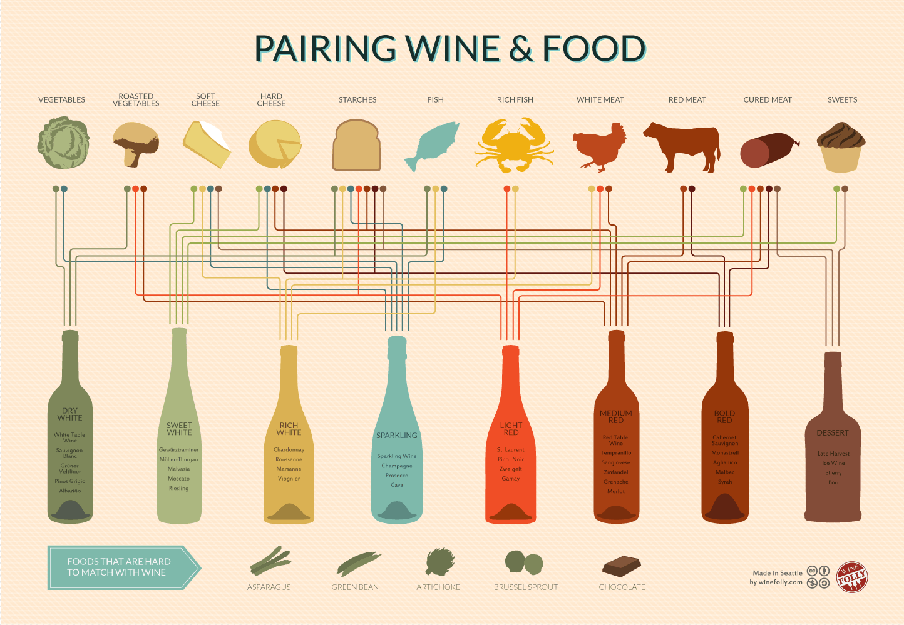

# Recipe Recommendation Bot
## What's cooking?

## Contributors
_______________________________________________________________________________________________________________________
- JJ Torres
- Shanel Kuchera
- Jihad Al-Hussain

## Project Description
______________________________________________________________________________________________________________________
- Create a tool that recommends recipes based on ingredients inputted to help you eat better food.
- Scrape over 5000 recipes from All Recipes using python and beautiful soup.
- Create a recipe recommendation system inputting ingredients on hand
- Build a client-facing API and a user-friendly app 

## Datasets to be used
_______________________________________________________________________________________________________________________
| Keras |
| Tensorflow |
| Classification |
| NLP |
| Wordcloud |

- [Fruits and Vegetables Image Recognition Dataset](https://www.kaggle.com/datasets/kritikseth/fruit-and-vegetable-image-recognition)
- [Food Images (Food-101)](https://www.kaggle.com/datasets/kmader/food41)

## Rough Breakdown of Tasks
_______________________________________________________________________________________________________________________
1. Create a skeleton plan for Project 2
2. Begin data importing process. 
3. Explore and clean data
4. Start the coding process 
5. Run multiple models
6. Include a wine pairing suggestion automatically based on recipe generated. White or red
6. Deploy a chatbot
7. Final question of end user... "Do you think this recipe was a good recommendation?"

_______________________________________________________________________________________________________________________

## Results from the Project

- successfully trained and tested the model using keras and tensorflow
    - The model can be improved by using a larger number of images
    - more techniques can be used to improve the model such as 
- successfully deployed the chatbot using the telegram API 
- investigated the use of Amazon lex as a backend to provide a better user experience by using the AWS-API as a backend

# Recipe_Recommendation_Bot
A deep learning CNN model with 9 layers used for image classification of food ingredients and recipes. This recipe recommendation bot will recommend recipes based on image or text user input. Deployed in the Telegram app under ASU_Chef_Bot.
